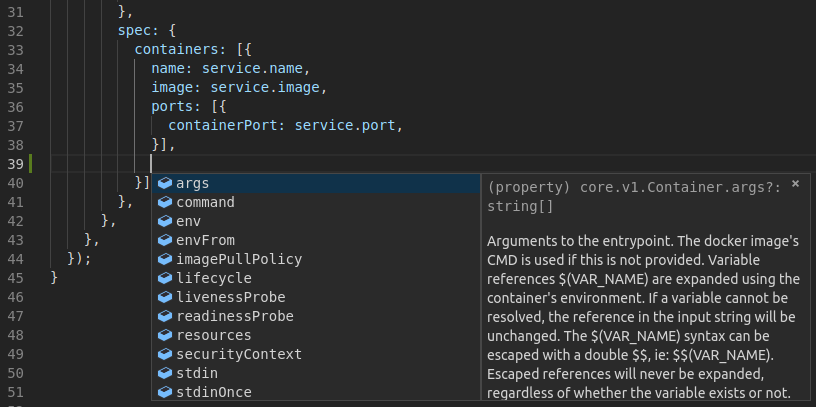

+++
title = "jk - Configuration as code with TypeScript"
date = 2019-06-12T10:21:00Z
updated = 2019-06-12T10:21:00Z
tags = ["jk", "configuration", "go", "javascript", "typescript"]
[author]
  name = "Damien Lespiau"
+++

> **Of all the problems we have confronted, the ones over which the most brain
> power, ink, and code have been spilled are related to managing
> configurations** — [Borg, Omega, and Kubernetes - Lessons learned from three
> container-management systems over a decade][bok]  

This post is the first of a series introducing [`jk`][jk]. We will start the
series by showing a concrete example of what [`jk`][jk] can do for you.

[`jk`][jk] is a javascript runtime tailored for writing configuration files.
The abstraction and expressive power of a programming language makes writing
configuration easier and more maintainable by allowing developers to think at
a higher level.

Let's pretend we want to deploy a `billing` micro-service on a Kubernetes
cluster. This micro-service could be defined as:

```yaml
service:
  name: billing
  description: Provides the /api/billing endpoints for frontend.
  maintainer: damien@weave.works
  namespace: billing
  port: 80
  image: quay.io/acmecorp/billing:master-fd986f62
  ingress:
    path: /api/billing
  dashboards:
    - service.RPS.HTTP
  alerts:
    - service.RPS.HTTP.HighErrorRate
```

From this simple, reduced definition of what a micro-service is, we can
generate:

- Kubernetes `Namespace`, `Deployment`, `Service` and `Ingress` objects.
- A `ConfigMap` with dashboard definitions that grafana can detect and load.
- Alerts for Prometheus using the `PrometheusRule` custom resource defined
  by the [Prometheus operator][prom-operator].


  {}

```yaml
apiVersion: v1
kind: Namespace
metadata:
  name: billing
```

  {}
  {}

```yaml
apiVersion: apps/v1
kind: Deployment
metadata:
  labels:
    app: billing
  name: billing
  namespace: billing
spec:
  revisionHistoryLimit: 2
  strategy:
    rollingUpdate:
      maxSurge: 1
      maxUnavailable: 0
  template:
    metadata:
      labels:
        app: billing
    spec:
      containers:
      - image: quay.io/acmecorp/billing:master-fd986f62
        name: billing
        ports:
        - containerPort: 80
```

  {}
  {}

```yaml
apiVersion: v1
kind: Service
metadata:
  labels:
    app: billing
  name: billing
  namespace: billing
spec:
  ports:
  - port: 80
  selector:
    app: billing
```

  {}
  {}

```yaml
apiVersion: extensions/v1beta1
kind: Ingress
metadata:
  annotations:
    nginx.ingress.kubernetes.io/rewrite-target: /
  name: billing
  namespace: billing
spec:
  rules:
  - http:
      paths:
      - backend:
          serviceName: billing
          servicePort: 80
        path: /api/billing
```

  {}
  {}

```yaml
apiVersion: v1
data:
  dashboard: '[{"annotations":{"list":[]},"editable":false,"gnetId":null,"graphTooltip":0,"hideControls":false,"id":null,"links":[],"panels":[{"aliasColors":{},"bars":false,"dashLength":10,"dashes":false,"datasource":null,"fill":1,"gridPos":{"h":7,"w":12,"x":0,"y":0},"id":2,"legend":{"alignAsTable":false,"avg":false,"current":false,"max":false,"min":false,"rightSide":false,"show":true,"total":false,"values":false},"lines":true,"linewidth":1,"links":[],"nullPointMode":"null","percentage":false,"pointradius":5,"points":false,"renderer":"flot","repeat":null,"seriesOverrides":[],"spaceLength":10,"stack":false,"steppedLine":false,"targets":[{"expr":"sum
    by (code)(sum(irate(http_request_total{job=billing}[2m])))","format":"time_series","intervalFactor":2,"legendFormat":"{{code}}","refId":"A"}],"thresholds":[],"timeFrom":null,"timeShift":null,"title":"billing
    RPS","tooltip":{"shared":true,"sort":0,"value_type":"individual"},"type":"graph","xaxis":{"buckets":null,"mode":"time","name":null,"show":true},"yaxes":[{"format":"short","label":null,"logBase":1,"max":null,"min":null,"show":true},{"format":"short","label":null,"logBase":1,"max":null,"min":null,"show":true}]},{"aliasColors":{},"bars":false,"dashLength":10,"dashes":false,"datasource":null,"fill":1,"gridPos":{"h":7,"w":12,"x":12,"y":0},"id":3,"legend":{"alignAsTable":false,"avg":false,"current":false,"max":false,"min":false,"rightSide":false,"show":true,"total":false,"values":false},"lines":true,"linewidth":1,"links":[],"nullPointMode":"null","percentage":false,"pointradius":5,"points":false,"renderer":"flot","repeat":null,"seriesOverrides":[],"spaceLength":10,"stack":false,"steppedLine":false,"targets":[{"expr":"histogram_quantile(0.99,
    sum(rate(http_request_duration_seconds_bucket{job=billing}[2m])) by (route) *
    1e3","format":"time_series","intervalFactor":2,"legendFormat":"{{route}} 99th
    percentile","refId":"A"},{"expr":"histogram_quantile(0.50, sum(rate(http_request_duration_seconds_bucket{job=billing}[2m]))
    by (route) * 1e3","format":"time_series","intervalFactor":2,"legendFormat":"{{route}}
    median","refId":"B"},{"expr":"sum(rate(http_request_total{job=billing}[2m])) /
    sum(rate(http_request_duration_seconds_count{job=billing}[2m])) * 1e3","format":"time_series","intervalFactor":2,"legendFormat":"mean","refId":"C"}],"thresholds":[],"timeFrom":null,"timeShift":null,"title":"billing
    Latency","tooltip":{"shared":true,"sort":0,"value_type":"individual"},"type":"graph","xaxis":{"buckets":null,"mode":"time","name":null,"show":true},"yaxes":[{"format":"ms","label":null,"logBase":1,"max":null,"min":null,"show":true},{"format":"short","label":null,"logBase":1,"max":null,"min":null,"show":true}]}],"refresh":"","schemaVersion":16,"style":"dark","tags":[],"time":{"from":"now-6h","to":"now"},"timepicker":{"refresh_intervals":["5s","10s","30s","1m","5m","15m","30m","1h","2h","1d"],"time_options":["5m","15m","1h","6h","12h","24h","2d","7d","30d"]},"timezone":"browser","title":"Service
    \u003e billing","uid":"","version":0}]'
kind: ConfigMap
metadata:
  labels:
    app: billing
    maintainer: damien@weave.works
  name: billing-dashboards
  namespace: billing
```

  {}
  {}

```yaml
apiVersion: monitoring.coreos.com/v1
kind: PrometheusRule
metadata:
  labels:
    app: billing
    maintainer: damien@weave.works
    prometheus: global
    role: alert-rules
  name: billing
spec:
  groups:
  - name: billing-alerts.rules
    rules:
    - alert: HighErrorRate
      annotations:
        description: More than 10% of requests to the billing service are failing
          with 5xx errors
        details: '{{$value | printf "%.1f"}}% errors for more than 5m'
        service: billing
      expr: |-
        rate(http_request_total{job=billing,code=~"5.."}[2m])
            / rate(http_request_duration_seconds_count{job=billing}[2m]) * 100 > 10
      for: 5m
      labels:
        severity: critical
```

  {}


What's interesting to me is that such an approach shifts writing
configuration files from a big flat soup of properties to a familiar API
problem: developers in charge of the platform get to define the high level
objects they want to present to their users, can encode best practices and
hide details in library code.

For the curious minds, the `jk` script used to generate these Kubernetes
objects can be found in the [jk repository][jk-micro-service].

## Built for configuration

We're building [`jk`][jk] in an attempt to advance the configuration
management discussion. It offers a different take on existing solutions:

- **`jk` is a generation tool**. We believe in a strict separation of
configuration data and how that data is being used. For instance we do not
take an opinionated view on how you should deploy applications to a cluster
and leave that design choice in your hands. In a sense, `jk` is a pure
function transforming a set of input into configuration files.

- **`jk` is cross domain**. `jk` generates JSON, YAML, [HCL][hcl] as well as
plain text files. It allows the generation of cross-domain configuration. In
the micro-service example above, grafana dashboards and Kubernetes
objects are part of two different domains that are usually treated
differently. We could augment the example further by defining a list of AWS
resources needed for that service to operate (eg. an RDS instance) as
[Terraform][terraform] HCL.

- **`jk` uses a general purpose language**: javascript. The configuration
domain attracts a lot of people interested in languages and the result is
many new Domain Specific Languages (DSLs). We do not believe those new
languages offer more expressive power than javascript and their tooling is
generally lagging behind. With a widely used general purpose language, we get
many things for free: unit test frameworks, linters, api documentation,
refactoring tools, IDE support, static typing, ecosystem of libraries, ...

- **`jk` is hermetic**. Hermeticity is the property to produce the same
output given the same input no matter the machine the program is being run
on. This seems like a great property for a tool generating configuration
files. We achieve this with a custom v8-based runtime exposing as little as
possible from the underlying OS. For instance you cannot access the process
environment variables nor read file anywhere on the filesystem with `jk`.

- **`jk` is fast!** By being an embedded DSL and using v8 under the hood,
we're significantly faster than the usual interpreters powering DSLs.

## Hello, World!

The `jk` ["Hello, World!" example][jk-alice] generates a YAML file from a js
object:

```js
// Alice is a developer.
const alice = {
  name: 'Alice',
  beverage: 'Club-Mate',
  monitors: 2,
  languages: [
    'python',
    'haskell',
    'c++',
    '68k assembly', // Alice is cool like that!
  ],
};

// Instruct to write the alice object as a YAML file.
export default [
  { value: alice, file: `developers/${alice.name.toLowerCase()}.yaml` },
];
```

Run this example with:

```console
$ jk generate -v alice.js
wrote developers/alice.yaml
```

This results in the `developers/alice.yaml` file:

```yaml
beverage: Club-Mate
languages:
- python
- haskell
- c++
- 68k assembly
monitors: 2
name: Alice
```

## Typing with TypeScript

The main reason to use a general purpose language is to benefit from its
ecosystem. With javascript we can leverage typing systems such as
[TypeScript][typescript] or [flow][flow] to help authoring configuration.

Types help in a number of ways, including when refactoring large amounts of
code or defining and documenting APIs. I'd also like to show it helps at
authoring time by providing context-aware auto-completion:



In the screenshot above we're defining a container in a `Deployment` and the
IDE only offers the fields that are valid at the cursor position along with
the accompanying type information and documentation.

Similarly, typing can provide some level of validation:


The IDE is telling us we haven't quite defined a valid `apps/v1`
`Deployment`. We are missing the mandatory `selector` field.

## Status and Future work

Albeit being still young, we believe `jk` is already useful enough to be a
contender in the space. There's definitely a lot of room for improvement
though:

- **Helm integration**: we'd like `jk` to be able to render Helm charts
client side and expose the result as js objects for further manipulation.
- **Jsonnet integration**: similarly, it should be possible to consume
existing jsonnet programs.
- **Native TypeScript support**: currently developers need to run the `tsc`
transpiler by hand. We should be able to make `jk` consume TypeScript files
natively a la [deno][deno].
- **Kubernetes strategic merging**: the object merging primitives are
currently quite basic and we'd like to extend the object merging capabilities
of the standard library to implement Kubernetes [strategic
merging][k8s-merge].
- Expose **type generation for Kubernetes custom resources**.
- More **helper libraries** to generate Grafana dashboards, custom resources
for the Prometheus operator, ...
- Produce **more examples**: it's easy to feel a bit overwhelmed when facing
a new language and paradigm. More examples would make `jk` more approachable.
- Integrate `jk` in [Kapitan][kapitan].

## Try it yourself!

It's easy to download `jk` from the [github release page][jk-releases] and
[try it yourself][jk-quickstart]. You can also peruse through the (currently
small amount of) [examples][jk-examples].

[ansible]: https://www.ansible.com/
[ansible-playbooks]: https://docs.ansible.com/ansible/latest/user_guide/playbooks.html#
[bok]: https://queue.acm.org/detail.cfm?id=2898444
[dap]: https://github.com/kubernetes/community/blob/master/contributors/design-proposals/architecture/declarative-application-management.md
[deno]: https://github.com/denoland/deno
[dhall]: https://github.com/dhall-lang/dhall-lang
[dhall-kubernetes]: https://github.com/dhall-lang/dhall-kubernetes
[flow]: https://flow.org/
[hcl]: https://github.com/hashicorp/hcl
[hiera]: https://wikitech.wikimedia.org/wiki/Puppet_Hiera
[jk]: https://github.com/jkcfg/jk
[jk-alice]: https://github.com/jkcfg/jk/tree/master/examples/quick-start/alice
[jk-examples]: https://github.com/jkcfg/jk/tree/master/examples
[jk-kubernetes]: https://github.com/jkcfg/kubernetes
[jk-k8s-overlays]: https://github.com/jkcfg/kubernetes/tree/master/examples/overlay
[jk-k8s-charts]: https://github.com/jkcfg/kubernetes/tree/master/examples/chart
[jk-micro-service]: https://github.com/jkcfg/jk/tree/master/examples/kubernetes/micro-service
[jk-quickstart]: https://github.com/jkcfg/jk/tree/master/examples/quick-start/alice
[jk-releases]: https://github.com/jkcfg/jk/releases
[jsonnet]: https://jsonnet.org/
[jsonnet-hermeticity]: https://jsonnet.org/articles/design.html
[k8s-declarative]: https://github.com/kubernetes/community/blob/master/contributors/design-proposals/architecture/declarative-application-management.md
[k8s-merge]: https://github.com/kubernetes/community/blob/master/contributors/devel/sig-api-machinery/strategic-merge-patch.md
[k8s-openapi-spec]: https://github.com/kubernetes/kubernetes/tree/master/api/openapi-spec
[kapitan]: https://github.com/deepmind/kapitan
[prom-operator]: https://github.com/coreos/prometheus-operator
[terraform]: https://www.terraform.io/
[typescript]: https://www.typescriptlang.org/
[yaml-aliases]: https://medium.com/@kinghuang/docker-compose-anchors-aliases-extensions-a1e4105d70bd
